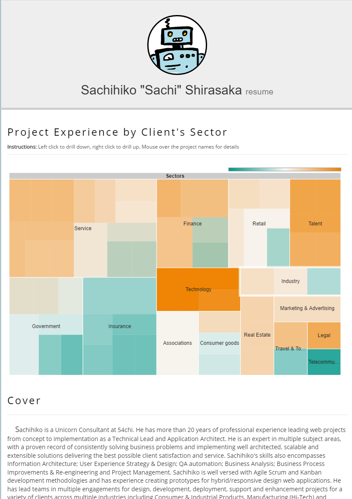

This was not part of the original roadmap, but whatever. It's my roadmap :)

The 5th project of the year is a resume builder. Yes, I know there are plenty out there, but trust me, this one is different.

Here are a few differences from your typical "resume template" out there.

1.  It's in codepen, so it should be very easy to modify if you know a bit of HTML, CSS and JavaScript. Or fork it, and make it your own.
2.  It uses Google Spreadsheet as its source. Yup: besides the section names and very few hardcoded values, the core lives in a spreadsheet, making it very easy to maintain (at least for me).
3.  It is integrated with Google Charts. So, you can be creative and add some pizzaz easily (I added a treemap per sector in mine)
4.  You don't need to host it anywhere. Codepen is free.

This is how it looks (as of Today):  

Updating it for whatever need you may have in the future should not be too hard. And I used SCSS instead of plain CSS, for ease of maintenance. I did a few tests earlier, and it took me 15 mins to change the format to make it look like the one used by my previous Employer (vs. spending 2 hours in the past copy pasting into their stupid PDF-editable template)

Now a few things that may or may not work for you:

1.  It still looks pretty standard. Nothing too crazy. Aka: you can print it or save it as a PDF
2.  Modifying the spreadsheet to add your own columns or structure will require tweaking on your side (if you just change the contents, you'll be fine though)
3.  The js coding is not the cleanest, sp. around the HTML generated on the fly (it can be better for the tooltip, for example). This is because I originally planned to avoid adding jQuery (but I realized mid-way that I was missing the "$" a lot :p)
4.  It is probably for people with a variety of projects. Otherwise the treemap will look kinda meh. You may have to adjust it (or remove the chart altogether)

With extra work, you could even port this, and instead of using Google Sheets, use your internal HR tool and all set for changes and updates (e.g. skill search, updating certifications automatically, import/export from linkedin, etc.)

Play with it if you like it.

Go [here](http://codepen.io/mochiron/pen/BKwdbj) for the codepen, or, if you prefer it in gist format, go [here](https://gist.github.com/54chi/f64ef9ffd48aadb6a4ab83a67091ce5e)
